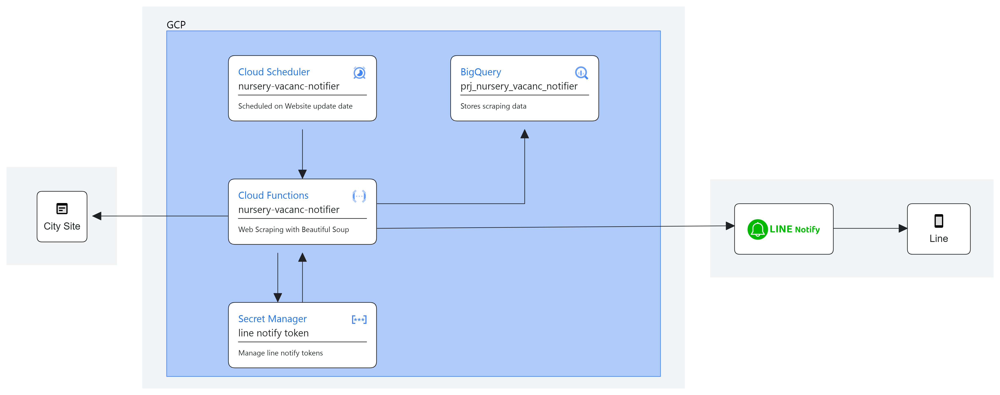

# nursery-vacanc-notifier
- 保育所の空き状況のデータを取得してlineで通知するシステム

# architecture


# 検証方法
- ローカルでDockerコンテナを立ち上げて検証

## 環境構築
- Docker
- make
- gcloud CLI（[インストール手順](https://cloud.google.com/sdk/docs/install)）

## 実施手順
1. リポジトリをクローン
    ```bash
    git clone https://github.com/9en/nursery-vacanc-notifier
    ```

1. gcloud CLIでログイン
    ```bash
    gcloud auth login
    ```

1. Docker Imageをビルド
    ```bash
    make build
    ```

1. Dockerコンテナを立ち上げる
    ```bash
    make run
    ```

1. ローカルでAPIを叩いてみる
    ```bash
    make local
    ```

1. ログを確認する
    ```bash
    make logs
    ```

# デプロイ方法
- ローカルからgcloud CLIを使ってデプロイする
- 以下stgのサンプルを記載
- prdの場合stgをprdに置き換えて実行

## 環境構築
- 検証環境と同様

## 実施手順
1. cloud functionsをデプロイ
    ```bash
    make deploy_stg
    ```

1. デプロイした環境設定を確認
    ```bash
    make deploy_stg_env
    ```

1. cloud funcstionsを実行する

1. ログエクスプローラからログを確認

1. cloud schedulerをデプロイ
   ```bash
   make scheduler_stg
    ```


